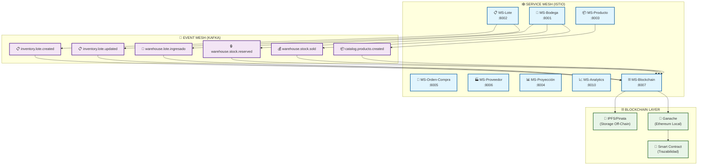
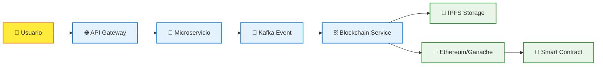
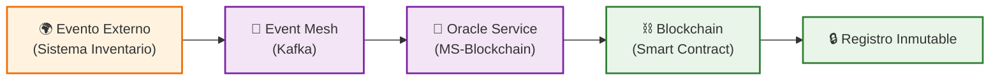
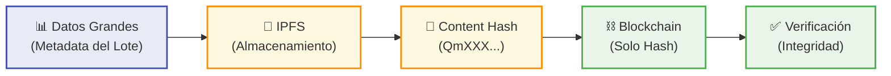
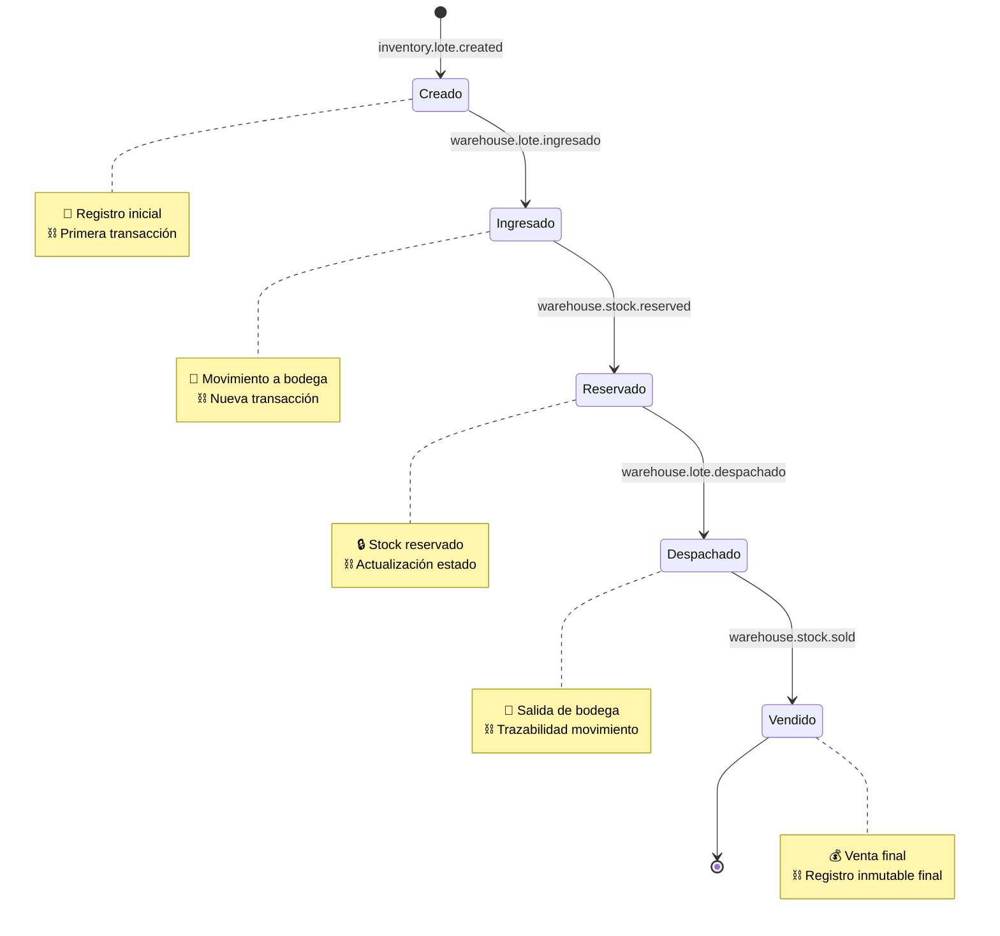
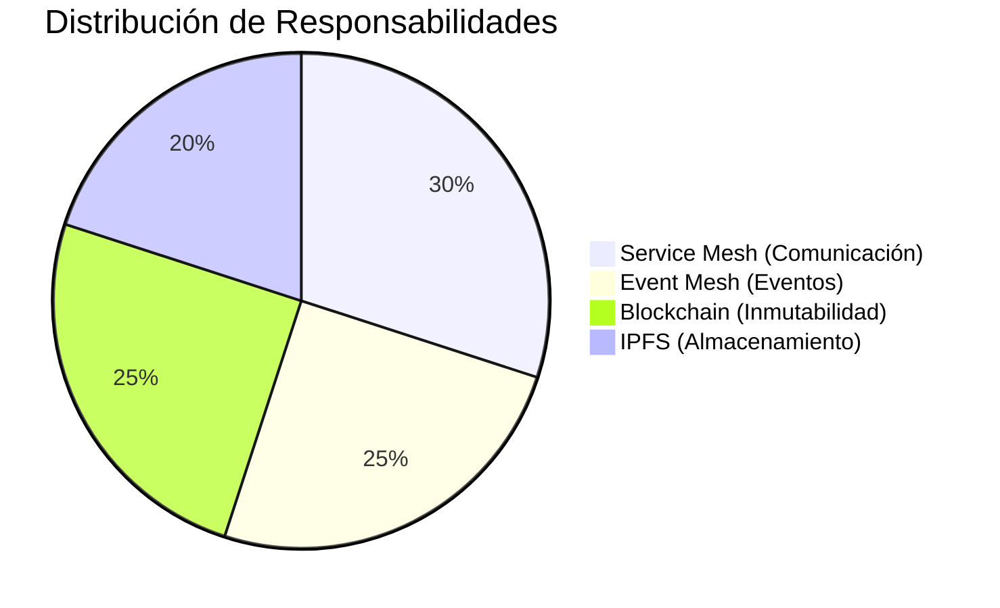

# 🏗️ ARQUITECTURA SISTEMA BLOCKCHAIN - MERMAID

## 📊 Arquitectura General Completa

## 🔄 Flujo de Datos Simplificado

## 🎯 Patrones Implementados

### 🔮 Patrón Oracle

### 📁 Patrón Off-Chain Storage

## 🔄 Estados del Lote (Trazabilidad)

## 📊 Distribución de Componentes

