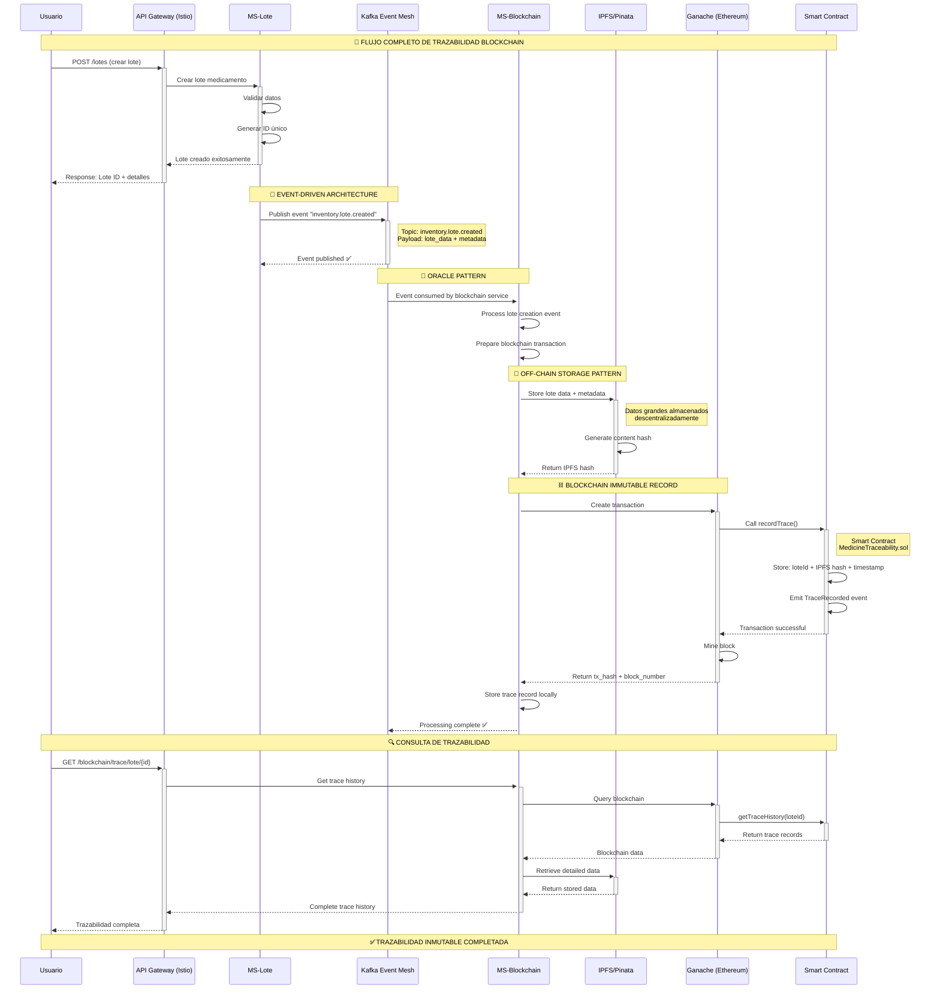
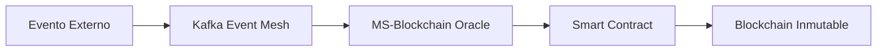
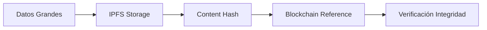
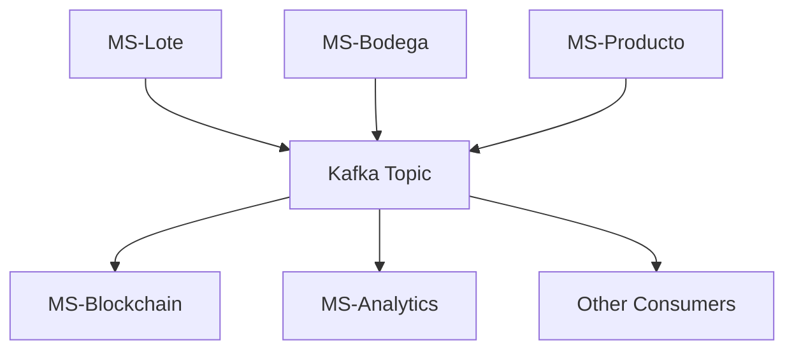
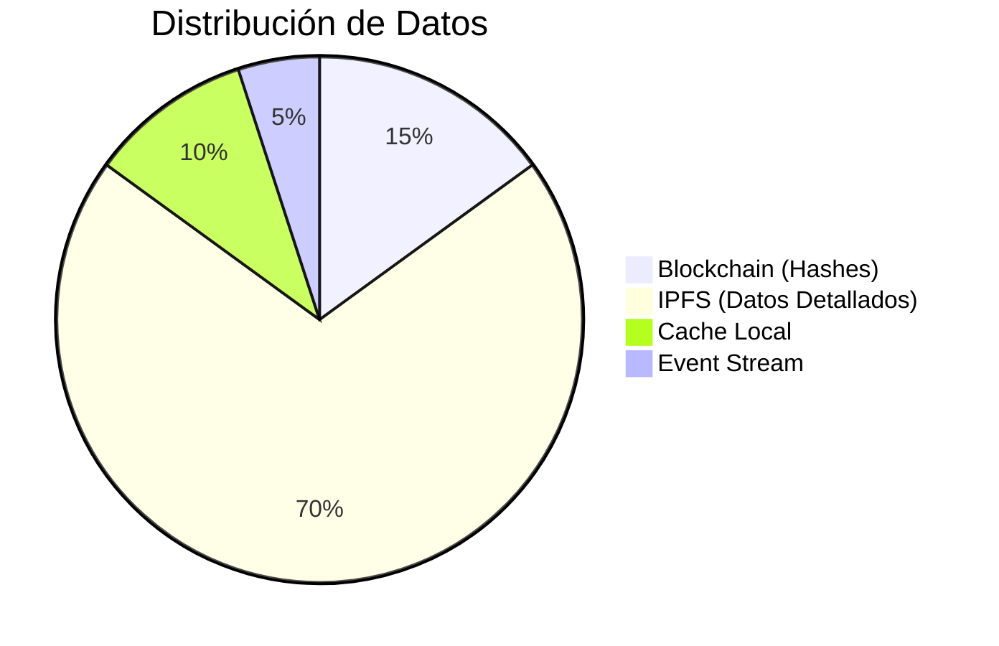
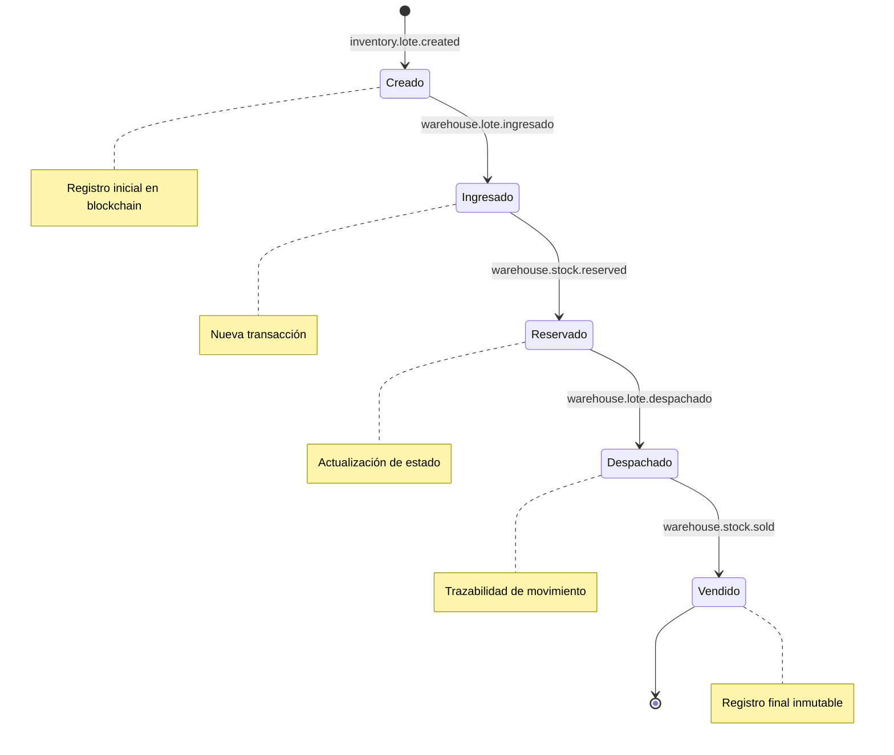

# 🔄 DIAGRAMA DE SECUENCIA - FLUJO COMPLETO BLOCKCHAIN

## Flujo Principal: Creación de Lote con Trazabilidad Blockchain

## 🏗️ PATRONES IMPLEMENTADOS

### 1. 🔮 **Oracle Pattern**

### 2. 📁 **Off-Chain Storage Pattern**

### 3. 📡 **Event-Driven Architecture**

## 🎯 BENEFICIOS DEL SISTEMA

| Componente | Beneficio | Implementación |
|------------|-----------|----------------|
| **Service Mesh** | Comunicación segura | Istio + Envoy |
| **Event Mesh** | Desacoplamiento | Kafka Topics |
| **Blockchain** | Inmutabilidad | Smart Contracts |
| **IPFS** | Descentralización | Content Addressing |
| **Oracle** | Datos externos | Event Consumers |

## 📊 MÉTRICAS DE TRAZABILIDAD

## 🔄 ESTADOS DEL LOTE

