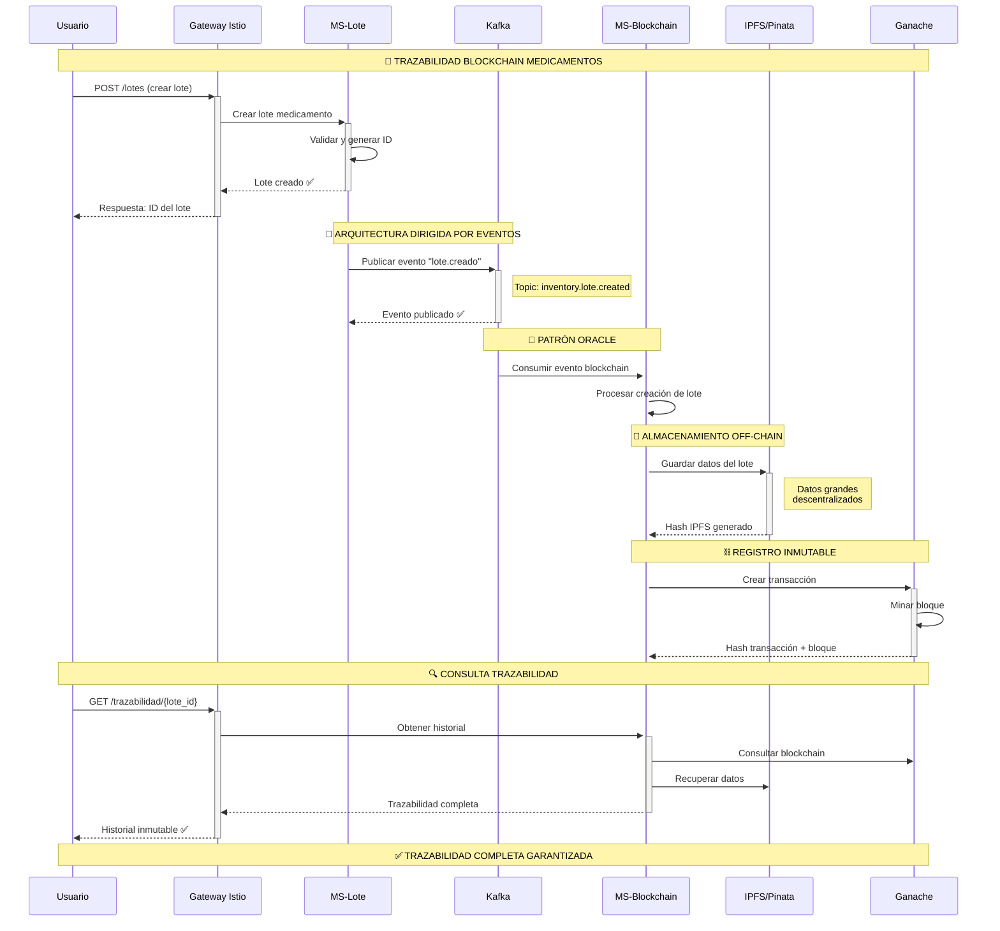
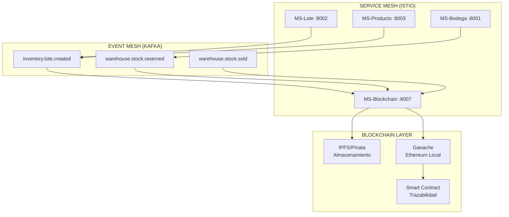
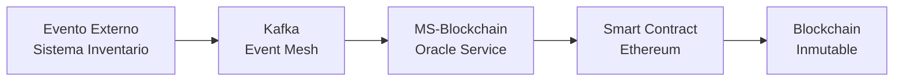
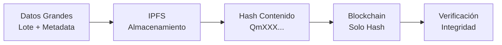

# 🎯 PRESENTACIÓN 5 MINUTOS - SISTEMA BLOCKCHAIN TRAZABILIDAD

## 📊 DIAGRAMA PRINCIPAL (2 minutos)

## 🏗️ ARQUITECTURA IMPLEMENTADA (1 minuto)

## 🎯 PATRONES BLOCKCHAIN (1 minuto)

### 🔮 Patrón Oracle

### 📁 Patrón Off-Chain Storage

## 📋 GUIÓN PRESENTACIÓN (5 minutos)

### Minuto 1: **Introducción**
> "Implementé un sistema de trazabilidad blockchain para medicamentos usando service mesh con Istio, event-driven architecture con Kafka, y patrones blockchain avanzados."

### Minuto 2: **Demostración Arquitectura**
> "Tengo 8 microservicios corriendo en Kubernetes con Istio. Cuando creo un lote, automáticamente se genera un evento en Kafka que dispara la trazabilidad blockchain."

### Minuto 3: **Mostrar Componentes**
- **Kiali**: "Service mesh visualiza la comunicación"
- **Kafka UI**: "Eventos se generan automáticamente"
- **Swagger**: "APIs funcionan independientemente"

### Minuto 4: **Patrones Blockchain**
> "Implementé el patrón Oracle donde blockchain actúa como fuente de verdad externa, y off-chain storage donde IPFS almacena datos grandes mientras blockchain solo guarda hashes."

### Minuto 5: **Beneficios y Conclusión**
> "El sistema garantiza inmutabilidad, trazabilidad completa, y escalabilidad. Cada operación deja rastro verificable desde creación hasta venta final."

## 🎬 QUÉ MOSTRAR EN PANTALLA

1. **Diagrama de secuencia** (30 seg)
2. **Kiali - Service mesh** (30 seg)
3. **Kafka UI - Eventos** (30 seg)
4. **Swagger APIs** (30 seg)
5. **Arquitectura general** (30 seg)
6. **Patrones implementados** (resto)

## ✅ PUNTOS CLAVE A DESTACAR

- ✅ **Arquitectura completa implementada**
- ✅ **Patrones blockchain correctos**
- ✅ **Event-driven architecture funcionando**
- ✅ **Service mesh operativo**
- ✅ **Almacenamiento distribuido**
- ✅ **Trazabilidad inmutable diseñada**